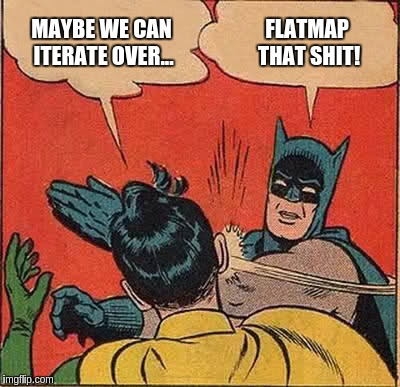

***
- title : Scala and OOP vs FP
- description : Introduction to Scala and functional programming
- author : Andreas Vilinski
- theme : solarized
- transition : default

*** 
- data-background : images/red-pill.jpg

# Scala vs Java and   What the ... FP ?

***

# Scala vs Java

- statically typed
- strong(er) type inference
- Functional + Object oriented
- everything is an object, including functions
- every function is a value - including methods

' Both are statically typed

***

# Scala vs Java

<section>

  

$ e = mc^2 $

$ errors = (more\ code)^2 $

Java

    [lang=java]
    Pair p = new Pair<Integer, String>(1, "Scala");
    String p1 = p.Item1;

Scala

    [lang=scala]
    val p1 = new MyPair(1, "Scala")
    val p2 = (1, "Scala")
    val (nr, name) = p2

</section>

***

### Object oriented programming

***

# What the ... [FP]() ?

- **OOP** -- objects everywhere
- **FP** - functions everywhere
- **OOP** Design patterns
- **Functional** design...

    <section>
    
Patterns

    
Tips

    
Approaches

    </section>

' in OOP is Object the first place where you look to

***

### OOP Design Patterns

<table style="textAlign: left">
<tr><td>

- Factory
- Strategy
- Decorator
- Visitor
- Builder
- ...

</td><td>

- `def factory()`
- `def sort(f)`
- `def decorate(x)`
- `def rec visit(x)`
- `def build(part1,part2)`
- `...`

</td></tr>
</table>

***

### SOLID principes

<table style="textAlign: top">
<tr><td>

- [**S**]()ingle Responsibiity (SRP)
- [**O**]()pen/Closed (OCP)
- [**L**]()iskov Substitution (LSP)
- [**I**]()nterface segregation (ISP)
- [**D**]()ependency inversion (DIP)

</td><td>

- **E**ach one is just a...
- Function
- Function
- Function too
- [FP patterns are different]()

</td></tr>
</table>

***

## Functional patterns

#### Some obligatory basic terms. It's really **easy**!

- Monoid, Monad, Comonad
- Functor, Bifunctor, Endofunctor
- Apomorphism, Isomorphism, Sigomorphism

<section>

Actually not needed, relax!

</section>

***

## Functional patterns

- Core principles:
    - functions are things
    - composition everywhere
    - types are not classes
- Functions as parameters
    - interface -> function
    - dependency injection -> partial application
    - chaining, continuation

***

### Function is a thing

- not attached to a class
- always **one** input, always **one** output
    - `apple => banana`
    - `(apple,banana) => ftuitSalad`
    - `apple => banana => fruitSalad`
    - `def mkSalad(apple)(banana): fruitSalad`

' in OOP is the Object where all the stuff is inside
' in FP it is the Function - no need for classes
' one input. If multiple - carry or tuple
' one output. In OOP is anyway a problem to return multiple values.
' Can also return Tuple
' In C# `ref` or `out` - avoid such things in scala

***

### Function is a thing

partial application

    [lang=scala]
    def add(x:Int)(y:Int) : Int = x + y // Int => Int => Int
    def add5 = add(5) _                  // Int => Int
    def add5mul2(add5 : Int => Int, x : Int) = add5(x) * 2

functional dependency injection

    [lang=scala]
    def persist[T](insert: T => ID)(log: T => Unit)(entity: T): ID
    def saveToMongo = persist(mongoInsert) _ _
    def saveToMongoLogToKafka = persist(mongoInsert)(kafkaLog) _
    saveToMongoLogToKafka(MdmProduct) // ObjectId(...)

    def mockPersist = persist(addToHashMap)(logToConsole)

***

### Function composition

    [lang=scala]
    (apple => banana) andThen (banana => cherry)
    (apple => cherry) // new function

***

#### Function composition

OOP

- objects in the large
- functions in the small

FP

- functions in the large
- functions in the small

Scala

- what ever you need

***

#### Function composition

    [lang=scala]
    // low level operation (micro service)
    String --> toUpper --> String

    // high level operation (service)
    --> lowLevel --> lowLevel --> lowLevel -->
    MdmProduct --> FeatureCleanup --> EncodexProduct

service is just like a microservice but without "micro"

***

### Types are not classes

- Data (List->List)
    - set of valid inputs
    - set of valid outputs
- Behavior (map, collect, filter, etc...)
    - not methods - functions
- Composition
    - AND - Product types - `case class`
    - OR  - Algebraic Data Types (ADT)

' Type is not a class in Java-meaning where all the getter/setter/methods and private variables are.
' Just a Data, or just a function
' Composition over inheritance

***

### Product types - case class

**AND**-composition

    [lang=scala]
    case class User(
        id: Int
        name: String
        address: Address
        contats: List[Contact]
    )

***

### ADT - algebraic data types

<section>

 

**OR**-composition

    [lang=scala]
    type FeatureValueId = Int
    sealed trait FeatureValue
    object FeatureValue {
        final case class Discrete(value: FeatureValueId) extends FeatureValue
        final case class Numeric(value: Double) extends FeatureValue
        final case class Literal(value: String) extends FeatureValue
        final case class Date(value: LocalDate) extends FeatureValue
    }
val displaySize = FeatureValue.Numeric(7.0) // Numeric

the same in F#

    type FeatureValueId = int
    type FeatureValue =
        | Discrete of FeatureValueId
        | Numeric of decimal
        | Literal of string
        | Date of System.DateTime
    let displaySize = Numeric 7.0m // FeatureValue

</section>

***

### ADT - algebraic data types

- Simple representation for complex cases
- **Make invalid state impossible**
- Each case is independent in scala
- Pattern matching ensures all* cases handled
    - (actually in scala not all)
    - `sealed trait` and `final case class`

***

## Scala tips and pitfalls

Things to avoid if not necessary. What to use instead

- `var` ==> `val`
    - prefer immutable
    - but mutable if performance critical
- `def` without parameters is also a function
- `foreach` ==> `map`, `flatMap`, `filter`, `fold`
    - scala's `for` is just syntactic shugar for `flatMap`
- `if .. else` ==> pattern matching
- Inheritance
    - ADTs
    - Composition over inheritance
    - CakePattern wit `trait`s - popular in scala

***

### Scala tips and pitfalls

`Option`: `Some(value)` or `None`

- `Option` is new `null`
- gives a meaning to `null`, not eliminates it
- **ADT** - must be handled on the place
- can cause NRE if comes from java
    - `new Option(javaObject)`
- slight performance drawback - heap instead of stack
- not overuse it, not propagate if not necessary
    - `flatMap` it away early or `getOrElse`
    - don't use `get` - runtime exception!

***

### Scala tips and pitfalls

    [lang=scala]
    val name: Option[String] = request getParameter "name"
    val upper = name map { _.trim } filter { _.length != 0 } map { _.toUpperCase }
    println(upper getOrElse "")

the same with `for`:

    [lang=scala]
    val upper = for {
        name <- request getParameter "name"
        trimmed <- Some(name.trim)
        upper <- Some(trimmed.toUpperCase) if trimmed.length != 0
    } yield upper
    println(upper getOrElse "")

***

### Scala tips and pitfalls

`import scala.util.{Try, Success, Failure}`

- Avoid throwing exceptions
- `Try` to catch them
- Better alternative to exceptions
- is also an **ADT**
- [ROP - Railway oriented programming](http://www.slideshare.net/ScottWlaschin/railway-oriented-programming)
- Happy way programming with flatmap

***

### Scala tips and pitfalls

    [lang=scala]
    def getURLContent(url: String): Try[Iterator[String]] =
    for {
        url <- parseURL(url)
        connection <- Try(url.openConnection())
        is <- Try(connection.getInputStream)
        source = Source.fromInputStream(is)
    } yield source.getLines()

***

### IntelliJ Tipps

- Ctrl+Shfit+A - search for commands
- Ctl+Q - Quick documentation. Shows which type infers scala if not explicit
- Ctl+Shift+P - Implicit parameters
- Scala Worksheet - REPL with interactive mode

***

### The Reality of a Developer's Life

**When I show my boss that I've fixed a bug:**

**When your regular expression returns what you expect:**

*from [The Reality of a Developer's Life - in GIFs, Of Course](http://server.dzone.com/articles/reality-developers-life-gifs)*

***

### Links

- [Goodbye, OOP](https://medium.com/@cscalfani/goodbye-object-oriented-programming-a59cda4c0e53#.irf8cza85)
- [FP pattern](https://fsharpforfunandprofit.com/fppatterns/)
- [Learn X in Y minutes - Scala](https://learnxinyminutes.com/docs/de-de/scala-de/)
- [Twitter Scala school](https://twitter.github.io/scala_school/)
- [Scala 2013 We're Doing It All Wrong](https://www.youtube.com/watch?v=TS1lpKBMkgg)