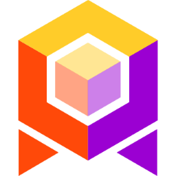
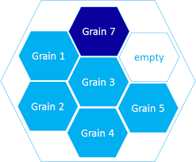

- title : Actor Systems
- description : Introducion to Actor Systems
- author : Andreas Vilinski
- theme : serif
- transition : slide

# Actor systems

***

## Agent-based Programming

a.k.a. [The Actor model](https://en.wikipedia.org/?title=Actor_model)

> ...is a mathematical model of concurrent computation that treats "actors" as the universal primitives of concurrent computation: in response to a message that it receives, an actor can make local decisions, create more actors, send more messages, and determine how to respond to the next message received.

First proposed in 1973!

---

## Ericsson AXD 301


- Erlang (1986) - 33 Years
- 99.999999999% uptime - "9 nines"
- over 20 years!
- ~0.631 secs downtime per year

## Erlang

- by Joe Armstrong at Ericsson
- SW Requirements:
    - Distributed - micro processes
    - Fault toleran - autorecover
    - Low latency - nanosecons
    - 99.9999 % Availability - hot module replacement

---

## Erlang beispielcode

```erlang
-module(ping_pong).
-export([ping/0, pong/0]).

ping() ->
    Receiver = spawn(ping_pong, pong, []),
    Receiver ! {self(), ping},
    receive
        pong ->
            pong
    end.

pong() ->
    receive
        {Sender, ping} ->
            Sender ! pong
    end.
```

---

## Erlang

- RabbitMQ
- DBs : Riak, SimpleDB (AWS), CouchDB
- Actor System
  - JVM
    -  Akka
  - .NET
    -  Akka.NET
    -  Orleans
    -  ProtoActor (.NET, Go)
    - ...

---

# Message passing

> In computer science, message passing sends a message to a process (which may be an actor or object) and relies on the process and the supporting infrastructure to select and invoke the actual code to run. Message passing differs from conventional programming where a process, subroutine, or function is directly invoked by name

From Wikipedia

The set of messages that a server (grain)
can process defines its public interface

---

# Actor fundamentals

- Actor
- ActorRef
- Message
- Mailbox
- Supervice-Strategies: one-for-one, one-for-all

### Allowed operations

- create another actor
- send a message
- designate how to handle the message

  private state

# Actor

' Welche Probleme löst actor system
' Classik 3-tier - device-service-db
' latency
' CQRS
' Actor

---

## Actor in Akka

- Actor System
- ActorRef
- Message
- Message box
- Single threaded core
- Resilient

---

## Actor in Orleans




- Virtual actor
- No explicit creation - always here
- No supervision - can't fail
- No ActorRef - simulates "normal" object reference
- Location transparent - just actor interface and ID

--

## Orleans smart cache pattern


Client -> Actor -> DB

---

### Akka.NET vs Orleans

Similarities:

- Separate Actors
- no memory share

|                 | Akka.NET               | Orleans                                |
| ----------------| ---------------------- | -------------------------------------- |
| Primary focus   | use full power         | Simplicity for distributed computing   |
|                 | Minimal abstraction    | natural behavior for non-experts first |
| Lifecycle       | explicit start and end | Actor is always available, can't fail and restart - activate, deactivate|
| Autocreation    | No, explicitely with supervision | Yes, activated when needed |
| Virtual actor space | Created on a given node, sharding | Actor -> Silos -> Cluster|
| Programming model | Actor | Virtual actor |
| Identified by   | ActorRef : ActorPath + UID | Actor ID - Guid, string, long |
| Location transparency | ActorRef - serializable representation of actor | No knowledge about location |
| Autoscale out   | Abstractions for explicit scaleout |StatelessWorker can have multiple activations, managed by runtime/workload |
| Actor interface |||

### Advangages Orleans vs Rabbit

-  Persistent Stream - TODO
-  Temp State or smart cache - when otherwise it should always be persisted, roundtrip to DB. Examples:
    - user session with short live info like what sites are already visited, which modules are allowed, etc
    - 2FA
        - generate random code on one endpoint (SMS, E-Mail, etc.),
        - expect input on other (e.g. click a link in E-Mail or SMS)
        - let expire after defined time - if short then just in unpersisted actor state, if longer - actor reminder
    - ticket state - accepting, closing, escalation
    - device state - onboarding, activation, etc.
- access from multiple instances to a shared state
    - runtime within each actor is single threaded. Other calls are waiting for the first
    - reentrant actor is not single threaded
- scheduler - already built into actor:
    - timer - transitive, cancelled if actor is disposed
    - reminder - persistent, survives between activation
    - own actors are possible
- interservice communication
    - Rabbit
        - send each message to queue
        - receive each message from queue in other (or same) service
    - Orleans
        - first time if other actor location (actor ref) not yet known - ask cluster
        - send message from actor to actor direct
    - in case of single process - just compile a single silo - add all relevant parts
- also useful within single service
    - no IHostedService needed
    - instantiation and disposing by need, not for each message
    - simple async communication for complicated scenarios:
        - ticket escalation
    - Orleans.Http - controller is an actor TODO

# Links

- https://github.com/petabridge/akka-bootcamp
