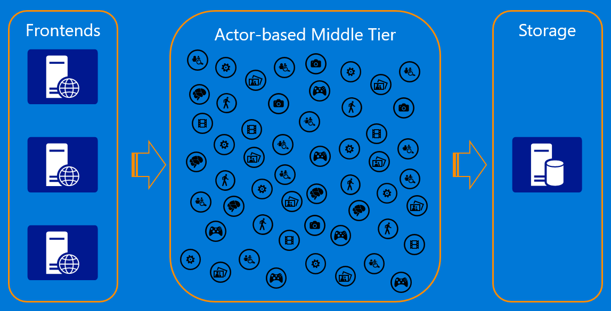

- title : Actor Systems
- description : Introducion to Actor Systems
- author : Andreas Vilinski
- theme : serif
- transition : slide

# Actor systems

***

## Erlang

- Erlang (1986) - 33 years
- by Joe Armstrong
- Ericsson
- SW Requirements:
    - Distributed - micro processes
    - Fault toleran - autorecover
    - Low latency - nanosecons
    - 99.9999 % Availability - hot module replacement

---

## Erlang beispielcode

```erlang
  %% A process whose only job is to keep a counter.
  -module(counter).
  -export([start/0, codeswitch/1]).

  start() -> loop(0).

  loop(Sum) ->
    receive
       {increment, Count} ->
          loop(Sum+Count);
       {counter, Pid} ->
          Pid ! {counter, Sum},
          loop(Sum);
       code_switch ->
          ?MODULE:codeswitch(Sum)
          % Force the use of 'codeswitch/1' from the latest MODULE version
    end.

  codeswitch(Sum) -> loop(Sum).
```

---

## Erlang

- RabbitMQ
- Actor System
  - JVM
    -  Akka
  - .NET
    -  Akka.NET
    -  Orleans
    -  ProtoActor (.NET, Go)

---

# Actor

' Welche Probleme löst actor system
' Classik 3-tier - device-service-db
' latency
' CQRS
' Actor

---

## Actor in Akka

- Actor System
- ActorRef
- Message
- Message box
- Single threaded core
- Resilient

---

## Actor in Orleans


- Virtual actor
- No explicit creation - always here
- No supervision - can't fail
- No ActorRef - simulates "normal" object reference
- Location transparent - just actor interface and ID

--

## Orleans smart cache pattern



Client -> Actor -> DB

---

### Akka.NET vs Orleans

Similarities:

- Separate Actors
- no memory share

|                | Akka.NET               | Orleans                                |
| -------------- | ---------------------- | -------------------------------------- |
| Primary focus  | use full power         | Simplicity for distributed computing   |
|                | Minimal abstraction    | natural behavior for non-experts first |
| Lifecycle      | explicit start and end | Actor is always available, can't fail and restart - activate, deactivate|
| Autocreation   | No, explicitely with supervision | Yes, activated when needed |
| Virtual actor space | Created on a given node, sharding | Actor -> Silos -> Cluster|
| Programming model | Actor | Virtual actor |
| Identified by  | ActorRef : ActorPath + UID | Actor ID - Guid, string, long |
| Location transparency | ActorRef - serializable representation of actor | No knowledge about location |
|Autoscale out | Abstractions for explicit scaleout |StatelessWorker can have multiple activations, managed by runtime/workload |
|Actor interface |||


# Links

- https://github.com/petabridge/akka-bootcamp
