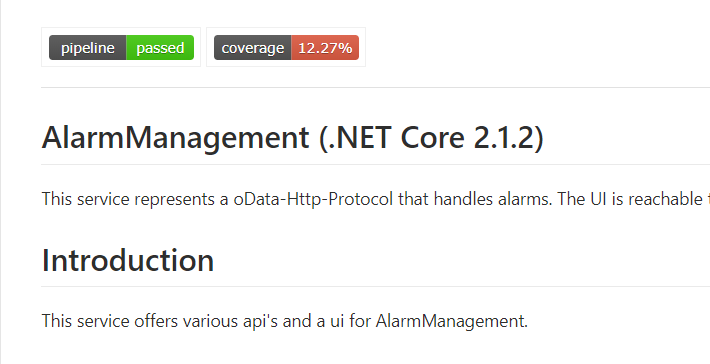
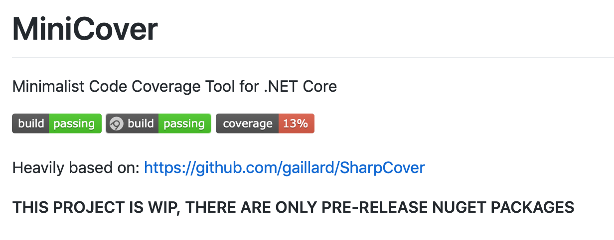
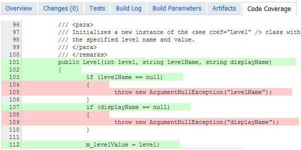
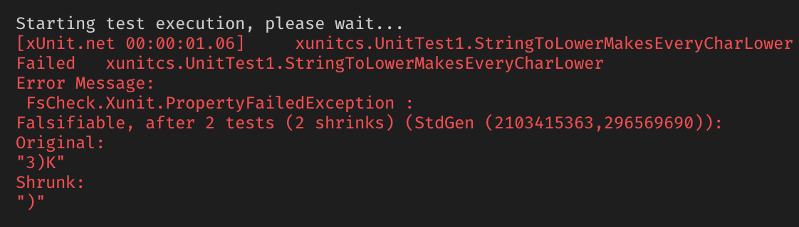

- title : FsCheck
- description : Introduction to FsCheck
- author : Andreas Vilinski
- theme : night
- transition : slide

***

# Tests Tests Tests

***

## Test Coverage

' Coverage badge bei uns in jedem Projekt
' Einerseits - Lakmuspapier, andererseits nutzlos
' TestCoverage testet nur die Fleiß der Tester, nicht die Korrektheit

---

## Test Coverage

---

## Test Coverage

---

### Test Coverage ~0 %

    [lang=cs]
    public class Useless {
        public static List<(string, int)> GetTop5Word(string txt) {
            return string.IsNullOrEmpty(text)
                ? new List<Tuple<string, int>>()
                : txt.Split(" ")
                     .GroupBy(x => x)
                     .Select(x => (x.Key, x.Count()))
                     .OrderByDescending(x => x.Item2)
                     .Take(5)
                     .ToList();
        }
    }
    public class UselessTests {
        [Fact]
        public void Coverage0() {
            Assert.Empty(Useless.GetCharsFrequency(null));
        }
    }

' hier ist coverage nah zum null
' deklarativen code aus Bibliothekfunktionen zu testen? Würde ich nicht

---

### Test Coverage 100 %

    [lang=cs]
    public class Useless
    {
        public static double Sin(double i)
        {
            return i;
        }
    }

    public class UselessTests
    {
        [Fact]
        public void Coverage100()
        {
            Assert.Equal(0, Useless.Sin(0));
        }
    }

' entgegenrichtung 100% coverage, method ist fehlerhaft
' braucht mehr als einen Test-Input

---

### Mehr Tests

    [lang=cs]
    public class UselessTests
    {
        [Fact]
        public void Sin0Test()
        {
            Assert.Equal(0.0, Useless.Sin(0.0));
        }
        [Fact]
        public void Sin30Test()
        {
            Assert.Equal(30.0, Useless.Sin(0.5));
        }
        [Fact]
        public void Sin90Test()
        {
            Assert.Equal(90.0, Useless.Sin(1.0));
        }
    }

' eine Variante für jede Testeingabe ein Method
' das hier sind Einzeiler, aber kann complexer werden
' wird durch copy/paste gelöst, was die tests brüchig macht

***

## Data-driven Tests or Raw tests

    [lang=cs]
    public class UselessTests
    {
        [Theory] //[Fact]
        [InlineData( 0.0, 0.0)]
        [InlineData(30.0, 0.5)]
        [InlineData(45.0, 0.70711)]
        [InlineData(60.0, 0.86603)]
        [InlineData(90.0, 1.0)]
        public void SinTest(double input, double expected)
        {
            Assert.Equal(expected, Useless.Sin(input));
        }
    }

Attribute <del>Fact</del> `Theory`

' Testframeworks anbieten hier die Raw Test, DataSource, oder InlineData
' So können wir weiter treiben. Mühsam, kann immer noch nicht alles abgedeckt sein

---

### Data-driven Tests or Raw tests

Schon besser, aber...

- Erlaubt sind nur primitive Typen (`string`, `int`, `double`, etc.)
- Werte müssen vorberechnet werden
- Immer noch Stichproben - nicht alle Werte Abgedeckt
- Test coverage % bleibt groß und ineffektiv

***

## Property-based tests

- Auch genannt: Fuzzy-Tests, Ungenaue Tests
- Kein "Neuland"
- In Haskell seit 1990's [QuickCheck](https://wiki.haskell.org/Introduction_to_QuickCheck2)
- Portiert in viele Programmiersprachen
    
- Python [Hypothesis](https://hypothesis.works)

    
- JS [JsVerify](https://github.com/jsverify/jsverify#documentation)

    
- .NET (F#, C#) [FsCheck](https://fscheck.github.io/FsCheck/), [Hedgehog](https://github.com/hedgehogqa), ...

' Portierungen haben in allen bekannten Sprachen
' Mit ähnlichen Namen
' Für .NET wird ein paar Seiten später FsCheck gezeigt

---

### Was sind Properties?

    [lang=cs]
    public class MyProperties {
        public Guid Id { get; set; }
        public string StringProperty { get; set; }
        public int OtherProperty { get; set; }
        public int AnotherProperty { get; set; }
    }

<b>Aber Achtung!</b> ...

C# Properties haben damit nichts zu tun 😀

---

### Property

    [lang=cs]
    var list = List<string> {
        "Alles", "kann", "man", "nicht", "testen"
    };

    public bool IsOrdered(List<string> list) {
        if (list.Count < 2)
            return true;
        for(var i; i++; i < list.Count - 1)
            if (list[i] > list[i+1])
                return false;
        return true;
    }

>"Ist die liste sortiert?" - JA/NEIN

' grob gesagt Property ist nur eine funktion
' bool Rückgabe bedeutet ob es erfüllt ist

---

### __Kein__ Property Test

    [lang=cs]
    [Fact] // [Theory]
    //[InlineData(list,orderedList)]
    public void MySortTest()
    {
        var input = List<string> {
            "Alles", "kann", "man", "nicht", "testen"
        };
        var expected = list.OrderBy(x => x).ToList();
        var actual = MySort(input);
        Assert.Equal(expected, actual);
    }

Nur <b>EINE</b> Stichprobe

' jetzt implementiere ich eine Sortierfuntkon und möchte die testen
' InlineData funktioniert mit Listen nicht
' Nut ein Test

---

### Property Test

- __Typ parameter__ bestimmt den gewünschten Eingabetyp
- __Generator__ - generiert zufällige Eingabe, konfigurierbar
- __Test__ - 100 mal, Anzahl konfigurierbar
- __Shrink__ - minimale Fehlerbedinung finden

---

### Property Test Beispiel

    [lang=cs]
    using FsCheck;

    [Fact]
    public void MySortTest() {
        Prop.ForAll<List<string>>(list => {
            var expected = list.OrderBy(x => x).ToList();
            var actual = MySort(list);
            // return (expected == actual);
            // return IsOrdered(actual);
            Assert.True(expected.SequenceEquals(actual));
        }).QuickCheck("MySort");
    }

zwei verschiedenen Wege zum Ziel:

' eine der Strategien zum Wahl der Property für Test

---

### Property

    [lang=cs]
    [Fact]
    public void JsonSerializerTest() {
        Prop.ForAll<AlarmViewModel>(input =>
            input.ToJson().FromJson<AlarmViewModel>() == input
            // in C# leider Referenzvergleich
        ).QuickCheck("MySort");
    }

- ... wenn keine Vorgabe existiert
    
- Z.B. Serializer, Daten-, Format-Converter, etc.

    
- Eine Schleife bauen

    
- Eingabe und Ausgabe vergleichen

' um zwei instanzen einer klasse zu vergleichen kann json verwendet werden

---

### Property

    [lang=cs]
    [Fact]
    public void TicketPostTest() {
        Prop.ForAll<TicketViewModel>(ticket => {
            var controller = ...
            Assert.DoesNotThrow(() => controller.Post(ticket));
        }).QuickCheck("MySort");
    }

Verhalten abgrenzen - für alle Eingaben keine Exceptions

' ...Oder einfach prüfen dass controller keine Exceptions wirft

---

### FsCheck - Testframeworks

    [lang=cs]
    using FsCheck.XUnit;

    [Property] // <--- Property Attribute
    public bool TicketPostTest(TicketViewModel ticket) {
        var controller = ...
        Assert.DoesNotThrow(() => controller.Post(ticket));
        return true;
    }

- NUnit
- XUnit
- Expecto
- ...

' es gibt unterstützung für NUnit und XUnit auch

---

### FsCheck - Testausgabe

    [lang=cs]
    [Property]
    public bool Increment_Twice_Is_The_Same_As_Adding_Two(int x)
    {
        return
            (Add(1, Add(1, x)) == Add(x, 2))
            .Classify(x > 10, "Bigger than '10'")
            .Classify(x < 1000, "Smaller than '1000'");
    }

<pre>
    Ok, passed 100 tests.
    63% Smaller than ‚1000‘.
    37% Smaller than ‚1000‘, Bigger than ’10‘.
</pre>

---

### FsCheck.XUnit output

    [lang=cs]
    public class Test
    {
        private readonly ITestOutputHelper _TestOutputHelper;
        public Test(ITestOutputHelper testOutputHelper)
        {
            _TestOutputHelper = testOutputHelper;
        }

        [Fact]
        public void Test1()
        {
            Prop
                .ForAll(...)
                .VerboseCheckThrowOnFailure(_TestOutputHelper);
        }
    }

---

### FsCheck Generator

Strings der gewünschten Länge generieren, z.B. für DB-Column

    [lang=cs]
    [Property]
    public bool SomeProviderTest1()
    {
        var str50 = Arb
            .Generate<string>()
            .Where(s => s != null && s.Length <= 50);
        Prop.ForAll(str50, description =>
        {
            var isSet = alarmProvider
                .SetDescription(alarmId, description);
            Assert.True(isSet);
        }).QuickCheckThrowOnFailure();
    }

---

### FsCheck Generator

Mehrere Test-Generatoren in einen kombinieren

    [lang=cs]
    var arbAddress =
        from city in str50
        from street in str100
        select (city, street);

    Prop.ForAll(arbAddress, (city, street) =>
    {
        var isUpdated = updater.SetAddress(city, street);
        Assert.True(isUpdated);
    }).QuickCheckThrowOnFailure();

---

### FsCheck Generator

Eigenen Generator registrieren, z.B. für abgeleitetet Klassen

    [lang=cs]
    public class TicketBodyGenerator
    {
        public static Arbitrary<ITicketBody> TicketBody()
        {
            var genMaintenance = Arb.Generate<Maintenance>().Select(x => (ITicketBody) x);
            var genLimitViolation = Arb.Generate<LimitViolation>().Select(x => (ITicketBody) x);
            var genTimeout = Arb.Generate<Timeout>().Select(x => (ITicketBody) x);
            var gen = Gen.OneOf(genMaintenance, genLimitViolation, genTimeout);
            return Arb.From(gen);
        }
    }
    ...
    Arb.Register<TicketBodyGenerator>(); // <-- vor der Benutzung
    Prop.ForAll((ITicketBody body) => { ... });

---

### Property Shrink

    [lang=cs]
    [Property]
    public bool StringToLowerMakesEveryCharLower(string input)
    {
        return input.ToLower().All(c => Char.IsLower(c));
    }

' hier ist ein beispiel das FsCheck nicht intuitive Fehler finden kann

---

### Links

- [FsCheck](https://fscheck.github.io/FsCheck/) - fscheck.github.io/FsCheck/
- [Code Beispiele in C# und F#](https://github.com/fscheck/FsCheck/tree/master/examples)
- [Choosing properties](https://fsharpforfunandprofit.com/posts/property-based-testing-2/)
- [Diese Folien](vilinski.github.io/presentations/2019/FsCheck)  - vilinski.github.io/presentations/2019/FsCheck

***

# Questions?

<table>
<tr><td>

</td><td>

> Beware of bugs in the above code; I have only proved it correct, not tried it.

Donald Knuth

</td></tr>
</table>

