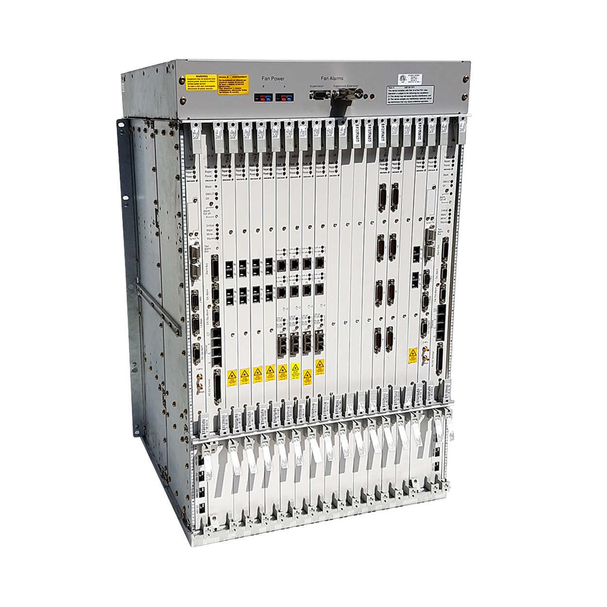
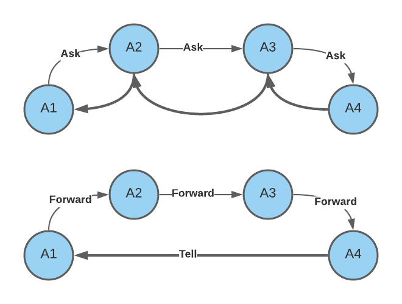
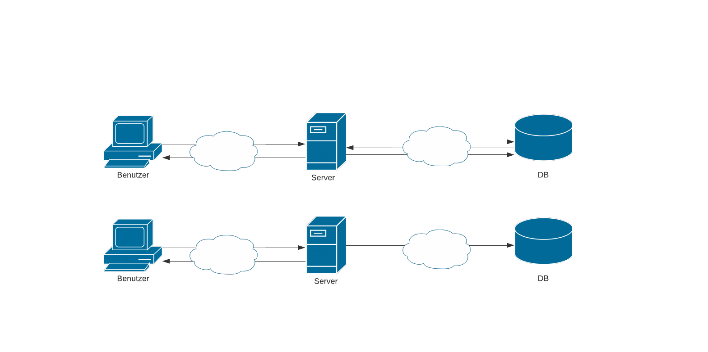

# Agenda

- Woher kommt ein Aktor
- Beweggründe
- Was ist ein Aktor
- Wann ist er nützlich
- Was zu beachten
- Vergleich der Implementierungen

::: notes

- Aktorsystem ist ein Pattern für die asynchrone programmierung. Es war schon mein Ziel das zu erzählen um meine praktischen Erfahrungen damit zu Teilen. Es könnte sein dass einige davon schon gehört haben, wissen aber nicht
wie oder wo es überhaupt nützlich ist.
- Es ist einwenig mehr zu erzählen im Vergleich zu einem typischen OOP pattern wie Mediator.
Ich versuche mich möglichst kurz zu fassen. Trotzdem möchte ich in die Zeit zurück greifen um zu erklären warum der Aktor so ist wie er ist.
- Ich erkläre die grundlegende Bestandteile von einem Aktor-System
- Welche probleme man damit lösen kann, inklusive bereits existierende in moneo-Kontext
- Und zum Schluss was man bei der Benutzung beachten sollte
- und welche Implementierungen unter .NET existieren

:::

# Prähistorische Fakten{ data-background-image="images/dinosaurs.webp" }

- Vorgeschlagen 1973
  - Erlang 1986
  - Akka (JVM, Scala) 2009
  - Akka.NET (C#)
  - inzwischen in vielen Programmiersprachen

::: notes

Mögliche Annahme dass es um ein neues Hype handelt sind falsch.
Der Pattern war bereits fast vor 50 jahre vorgeschlagen
Erste Implementierung ist auch schon 35 Jahren her
Am 1986 zuerst implementiert von Joe Armstrong, der damals bei Ericsson gearbeitet hat.

:::

## Herkunft{ data-background-image="images/dinosaurs.webp" }


::: notes

Erstanden ist das System in der Zeiten wo Compouter noch gross und Teuer wie eine Wohnung waren
Die damalige Architektur war viele schwachen CPUs in einem Mainframe und der Kommunikation
über beschreiben der ausgewiesenen Speicherbeireiche in einem gemeinsamen Speicher.
Was wie Altlast aussieht funktioniert bis heute noch sehr gut.

:::

## &nbsp;{ data-background-image="images/joe-armstrong-blog.jpg" }

{ .fragment data-transition="fade-in"}

# Beweggründe

- das Ende der Moore's Law-Periode
- Amdal-Gesetzt muss berücksichtigt werden
- Diskrepanz zw. OOP und Prozessen in der realen Welt
- Programmiersprachen ohne OOP
- Stateless - erstrebenswert, aber nicht immer möglich

::: notes

Auf dem Weg zum einem Leistungsfähigem system gibt es leider ein paar Dinge zu beachten
- Der Moor-Law scheint zu Ende zu sein
- Amdal-Law ist was man bei der Bau von verteilten Systemen nicht umgehen kann
- Es gibt ein Problem mit dem OOP-Ansatz, der heute als "klassisch" bezeichnet wird
- Und es sind nicht alle Programmier sprachen OOP-First sind

:::

## Wachsende Anforderungen

- Großes System 1995-2005
  - 10x servers
  - latency - seconds
  - maintenance stop 1-2h per month
  - Gigabytes
- Großes System 2015-2021
  - 100x servers (cluster nodes)
  - latency - ms
  - maintenance stop - none
  - Petabytes

::: notes

TODO no fragments

:::

## Moore Law


::: notes

Seit einiger Zeit ist die Beschleunigung der CPU an die Physikalische Gesetze gestoßen.
Die Frequenz kann man nicht mehr erhöhen, nur Anzahl der Kerne
Um davon ein Vorteil zu haben muss aber das Programm entsprechend geschrieben werden.

:::

## Amdal law


::: notes
Amdal law

| # cores /parallelisierbarkeit % | 10   | 100  | 1000 |
|---------------------------------|------|------|------|
| 0 %                             | 10   | 100  | 1000 |
| 10 %                            | 5.26 | 9.17 | 9.91 |
| 25 %                            | 3.08 | 3.88 | 4.00 |
| 40 %                            | 2.17 | 2.46 | 2.50 |


- 1967 Gene Amdahl (IBM)
- Gesamtzeit `>=` langsamste sequentielle fragment
- Zeitgewinn begrenzt durch Parallelisierbarkeil

:::

## OOP Diskrepanz

- Modernes OOP = Klassenhierarchie
- Alan Kay - "Mit OOP habe ich nicht C++ gemeint"
- Alan Kay's OOP - Messaging und Incapsulation

- Modellierung ~~der realen Welt~~ des Puppentheaters
- OOP Duck doesn't quack
- Viele Objekte, Zustände, asynchronen Aufrufe
- Zustandverwaltung und Kommunikation-Koordinierung, Thread-Schutz

::: notes

- Dazu kommt noch das Problem, das OOP nicht ganz der realen Welt entspricht.
- Der Erfinder von OOP Alan Kay hat auch sich beschwert, dass er es anders gemeint hat.
  dass die Objekte die Nachrichten austauschen, und müssen nicht warten, bis die empfangen werden.
  Dieses Prinzip, Messaging, ist nur in SmallTalk und ObjectiveC verwendet worden
- Das synchrone Warten auf Antwort, ist ein nachteil in vielen Hinsichten. Es sind viele Objekte in system

:::

## Zustandverwaltung

```cs

public enum SubscriptionState
{
    Created, DriverFound, DriverInitialized, BehaviorsInitialized,
    Ready, Starting, Stopping, Ok,
    ReceiveError, TransmitError, StartupError,
    Stopped, Disposed,
    ConnectionProblem, Connecting,
}

```

::: notes

Synchrone Method-Aufrufe sind nachteilig in vielen Hinsichten. Bei sehr vielen Objekte kann nur ein in einem Thread bearbeitet werden.
Es sind tausende oder millionen von Objekten im Runtime, die ihr Zustand oder sogar Verhalten ändern.
Multithreading ist hier eine Aushilfe, bringt aber gefahren mit der Inkonsistenz. Es wirt plötzlich ein Schutz gegen mehrfache Änderung gebraucht.

:::
## 1. naive Ansatz - `lock`

```csharp
public class TreeController {
  public Task MoveNode(Guid nodeId, Guid toNode) {
    lock (topologyTree) {
      // WORK ...
    }
  }
}
```

- Locks doesn't scale
  -  mehrere service-instanzen == lock überflüssig
  - mehrere http-Requests == zu viele Resourcen sind eingefroren

::: notes

erste naive Anzatz sind semaphore, oder locks. Sowas ähnliches war vor kurzem noch in der Topologiemanagement.
Um konsistenz im Topologiebaum zu bewahren braucht man einen Snapshot von einem kompletten Topologie, um die Knoten da drin zu bewegen
Offensichtlich funktioniert der lock nicht, wenn wir mehrere Instanzen von einem Service haben. Das macht den lock überflüssig.
Und das begrenzt die Performance eben in einem einzigen Service-Instanz - zu viele Entitäten sind eingefroren nur um konsistenz zu haben.
Und die Reihenfolge von asynchronen Aufrufen ist niemals garantiert.

:::

## 2. Dedicated thread{ data-background-image="https://images.unsplash.com/photo-1616349761870-25501ed04173" }

Beispiel - IFM.SDK

- 1 Device - 2 Threads
- 1000 Devices - 2000 Threads
- .NET Core thread pool - 250 threads per core
- signifikante Zeit wird beim Warten verbraucht

::: notes

Der zweite Ansatz wäre die requests in Commands umzuwandeln und die sequentiell in einem thread ausführen.
Ein Separate thread - ein separater thread.
Das ist beispielweise in IFM.SDK so implementiert, eine Bibliothek, die unser Drivermanagement service intern benutzt
Hier ist ein Entität ein Device statt ein Knoten, was die sache nicht ändert
Die rumänischen Kollegen haben es nach ihren aussage "aus performance Gründen" ein Thread pro überwachten Gerät angelegt.
Das ist schon mal besser, die haben auch Benchmarks gemacht und 300k messages/s erreicht.
Das ist schon besser als locks für kompletten Bestand, funktioniert aber auch solange anzahl der Geräte relative niedrig ist.
Bei 800 Datasources hat das moneo schon probleme wegen zu vielen threads.

:::

## 3. Threads ausleihen{ data-background-image="https://images.unsplash.com/photo-1583758638276-95fff693eecf"}

- Objekte wachen auf, nur für kurze Zeit Berechnung
- Zustand-Änderungen werden sequentiell gemacht und nur vom Objekt selbst
- Lokalität beim Prozess-Nachvollziehen

::: notes

Ein Thread verbraucht auch viele Resource. Windows reserviert 1MB physikalischen Speicher pro Thread.
Jetzt wenn wir 1k Geräte haben verbrauchen wir 1GB RAM nur für Threads, die die meiste Zeit nur auf Nachrichten warten
In IFM.SDK sind nicht consequent dedicated threads, sondern auch noch Tasks in normalen "async/await" thread pool.
Ist ja klug. Das Ziel von Thread pools ist die Anzahl von Threads gering zu halten, um nicht zu oft switchen zu müssen.
Die State-Machine, die C#-Compiler für async/await produziert hat aber auch nachteile, weil es auch alloziert und zerstört werden muss

Jetzt sind wir langsam bei der Actor-Model gelandet
- Ein aktor hat einen eigenen Thread, der nur dann ausgeliehen ist, wenn die Nachrichten kommen
Er wacht kurz auf um eine Nachricht zu bearbeiten.
- Die Nachrichten werden dazu streng sequentiell bearbeitet. Beides bedeutet, dass interne Zustand vom Aktor
  nicht thread-safe sein muss. Z.B. man braucht kein ConcurrentDictionary, es darf normale Dictionary sein
:::

# Actor{ data-background-image="https://proto.actor/docs/images/actor.png" }

<br>

## Actor kann{ data-background-image="https://proto.actor/docs/images/actor.png" }

::: {.columns}
:::: {.column width="30%" }
<br>
::::
:::: {.column width="70%" }

<br>

-
- (nur) mit PID identifiziert/adressiert werden (Ortstransparenz)
- (nur) sein eigenes Zustand und Verhalten ändern
- __Sequentiell__ Nachrichten bearbeiten
- Nachrichten an die anderen schicken
- andere Aktoren starten und überwachen (supervise)

::::
:::

## Aktor vs klassisches OOP

#### Objekt

- sind nicht lebendig, gehören nicht sich selbst
- Thread Besitzer (SubscriptionManager) - besitzt die Kontrolle (Subscription)

#### Aktor

  - fast immer schlafendes Prozess
  - kontrolliert (__NUR__) sein eigenes Zustand
  - kommuniziert asynchronen mit Nachrichten
  - "Tell, don't Ask" Prinzip
  - schickt Nachrichten, (meistens) keine Anfragen
  - auf die möglicherweise eine Antwort folgt

## Vorteile

- message-driven design
- funktionale Transformation: `A -> f -> B`
- strenge Isolation und Entkopplung
- kein manuelles Thread-Management
- kein Schutzmechanismus für Public-Eigenschaften
- keine Race-Conditions

## Mögliche Einsatzbeispiele

::: {.columns}
:::: {.column width="50%" }
Aktor als Entität

- Device
- Subscription
- Eingeloggte User
- Ticket
- Element der Workflow
::::
:::: {.column width="50%" }
Aktor als Manager

- Rohdatenaufzeichnung
- DB provider - read/write
- Notification-Sender
- SignalR-Hub
- Limit-Watcher
::::
:::

# Hello world

```csharp
public class Hello {
  public Hello(string who) => Who = who;
  public string Who { get; } // no setter
}
//public record Hello(string who);

public class HelloActor : IActor {
  public Task ReceiveAsync(IContext context) {
    object msg = context.Message;
    if (msg is Hello r)
      Console.WriteLine($"Hello {r.Who}");
    return Task.CompletedTask;
  }
}
```

::: notes

- Man braucht eine Menge von Nachrichten-Typen. Umso schade ist es dass
  C# erfordert viel boilerplate um einfache Nachrichten-Klassen zu definieren.
  Wobei in Scala und F# ist es Einzeiler
- Nachrichten sind immutable. In C# kann es nur mit nicht-default constructor gemacht werden
- C# 9.0 hat endlich records, die zwar immer noch nicht gut genug sind, aber schon viel kürzer
- IActor implementiert eine einzige Methode Receive funtkion. Die hat zwar `Async` suffix, ist aber
  technisch single-threaded. `async` ist entfernt um warnung zu vermeiden.
- weil actor ist +- Kopie von Erlang, wo es gar keine Typen sind.
  `context.Message` ist hier auch ein `object`. Um zw. Nachrichten zu unterscheiden braucht man
  pattern-matching. Bisher hat C# nur switch mit strings und integers. Es gibt aber eine Entwicklung
  Zumindest kann man inzwischen switch expression an Typen machen.
  Solange kann man bekannte Shclüsselwort `is` benutzen.
- Es gibt noch eine Anzahl von vordefinierten, sogenannten System-Nachrichten, auf die man auch reagieren kann
  Sonst wenn es kein bekannter Typ ist wird es einfach ignoriert. Oder z.B. in Dead-Letter geschickt.


:::

## Deklarative Props

```csharp
var system = new ActorSystem(); // (1)

//var props = Props.FromFunc(c => {...});
var props = Props.FromProducer(() => new ParentActor()) // (2)
  .WithMailbox(mailbox)
  .WithContextDecorator(c => new LoggingDecorator(c))
  .WithHashMapping(Routing.ConsistentHashMapping akamai)
  .WithSenderMiddleware(next => {...})
  .WithChildSupervisorStrategy(
    new OneForOneStrategy(Decider.Decide, 1, null));

var pid = system.Root.Spawn(props); // (3)
system.Root.Send(pid, new Hello("ProtoActor")); // (4)
```

Aktor intern hat keine Info darüber

## Behavior

```csharp
public class Necromant : IActor {
  private Behavior _behavior = new Behavior(); // (1)

  public Necromant() {
      _behavior.Become(Resting); // (2)
  }

  public Task ReceiveAsync(IContext ctx) =>
      _behavior.ReceiveAsync(ctx); // (3)

  private Task Resting(IContext ctx) {...}
  ...
}
```

## Behavior

```csharp
public class Necromant : IActor {
  ...
  private Task Resting(IContext context) {...}
    switch (context.Message) {
      case SwordHit damage: // (1) Info von der Nachricht
        _health -= damage; // (2) Zustand
        var nextBehavior = (_health > 0.5) ? Fighting : Run;
        _behavior.Become(nextBehavior); // (3) Behavior
      case Touch _ :
        context.Respond("Cold"); // (4) Antwort an Sender
    }
    return Task.CompletedTask;
  }
  private Task Fighting(IContext ctx) { ... }
```

## `Tell, don't Ask`

- Einzige Kommunikationsweg - Nachrichten
- `Send` - Tell by default
- `RequestAsync` - Ask nur ven nicht anders geht.
    - z.B. `HttpRequest`
    - Empfang anhalten bis die Antwort kommt
    - thread bleibt reserviert
    - `await ctx.RequestAsync(rcvPID);`{ .csharp }
    - `ctx.Respond(new Answer(42));`{ .csharp }


## Controller tell

```csharp
[ApiController, Route("[controller]")]
public class ActorController : ControllerBase {
  [HttpPost]
  public ActionResult AddPanel(string name)
  { // synchron ist ok
    var msg = new AddPanelRequest(name);
    SystemActors.SignalRActor.Send(msg); // tell
    return Accepted();
  }
}
```

::: notes

Hier ist ein Beispiel wie man ein actor im Controller benutzen kann.
Bemerke dass es kein async/await benötigt, sonst würde C# Compiler eine Warning produzieren.
In akka und akka.net heißen die Methoden wirklich `Tell` und `Ask`
Hier ist beispiel mit `proto.actor`, `Send` ist eine synchrone operation, die die Kontrolle sofort zurückgibt.
Wenn jemand RabbitMQ Client benutzt hat, dort ist publish genauso eine synchrone methode.
Der Controller kann in dem Fall HTTP Code 202 zurückgeben (accepted).
Bedeutet request angenommen, Message ist unterwegs, kann auch länger dauern, ohne dass auf request gewartet werden muss.
Hier ist es unter SystemActors.SignalRActor eine feste PIC gespeichert.
Könnte eine statische Klasse oder Singleton sein
Für skalierbarkeit kann dahinter ein pool von aktoren sein, die parallel http requests bearbeiten.

:::

## Controller ask

```csharp
public ActorController(ActorSystem actorSystem) =>
  _sys = actorSystem;

[HttpPost]
public async Task<Guid> AddPanel(string name)
{
  var props = _sys.DI().PropsFor<RequestActor>(); // (1) DI
  var pid = _sys.Root.Spawn(props);
  var msg = new AddPanel(name);
  var timeout = TimeSpan.FromSeconds(10); // (2)
  var panel =
    await _sys.Root.RequestAsync<Added>(pid, msg, timeout);
  await _sys.Root.StopAsync(pid); // (3) Stop it
  return panel.Id;
}
```

::: notes

Weil Actor leichtgewichtig ist, kann man für jeden http Request einen neuen starten.
hier wird actor system decorator mit DI verwendet. D.h. actor benutzt DI container um eine instanz zu erzeugen
Alternativ kann es ein festes PID sein, der auf alle requests antwortet.
Für skalierbarkeit kann dahinter ein pool von aktoren sein, die parallel http requests bearbeiten.
Auch ist es möglich DI zu nutzen. Wobei man verliert den Vorteil, dass keine Allocations
für jeden request gemacht werden

:::


## Forward



## Stash

```csharp
private Task Paused(IContext context) {
    switch (context.Message)
    {
        case Data _ :
          context.Stash(); // (1) not handling yet
        case Enough _:
          context.UnstashAll(); // (2) into inbox again
          _behavior.Become(Idle); // (3) don't collect anymore
          return Task.CompletedTask;
    }
    return Task.CompletedTask;
}
```

::: notes

Beispiel Echtzeit-Analyse Grafik anzeigen.
Dann mchte der Benutzer es Pausieren, um die Laufende Daten anzuschauen
Genau dieses Beispiel gibt es in der praktischen Übungen in der Akka-Bootcamp. Das verlinke ich später

:::

# Performance{ data-background-image="https://images.unsplash.com/photo-1502855991536-374994f6291c"}

Developer Laptop, 1 000 000 calls

| Method           | Zeit, s  | RPS msg/s |
|------------------|----------|---------|
| `void` Method    | 0.003    | 300 M/s |
| `int` Method     | 0.004    | 250M/s  |
| `Task` Method    | 1.864    | 500K/s  |
| `Task<int>` Method | 1.790  | 500K/s  |
| Akka.NET Tell    | 0.233    | 4M/s    |
| Akka.NET Ask     | 6.395    | 150K/s  |

## Benchmarks Actorsysteme{ data-background-image="https://images.unsplash.com/photo-1502855991536-374994f6291c"}

| Lib                | Remote  | Inproc  | SkyNet |
|--------------------|---------|---------|--------|
| Erlang             | 200k/s  | 12 M/s  | 0.75s  |
| Akka               | 110k/s  | 38 M/s  | 9.0s   |
| Akka.NET           | 38k/s   | 30 M/s  | 12s    |
| Proto.Actor Go     | 2.4M/s  | 120 M/s | 1.5s   |
| Proto.Actor C#     | 2.5M/s  | 125 M/s | 0.8s   |
| Proto.Actor Kotlin | 2.7M/s  | 160 M/s | 0.31s  |

# Error handling

- Widerstandsfähigkeit (resilience)
- Überwachung (supervision)
- Isolation
- deklarativ statt try/catch
- Fail-Fast Prinzip

::: notes

da es in telekom zuerst projektiert war eine der Anforderungen war ausfallsicherheit
Wenn ein Teil der Hardwäre ausfällt sollte es möglichst keine Auswirkung auf den Rest haben
Der supervisor ist benachrichtigt und kann Maßnamen einleiten.

:::
## Exceptions in `C#`

```{.csharp .lineNubmers }
try
{
  connection.ExecuteCommand(cmd); // eigentliche Arbeit
}
catch (SqlException ex)
{
  // Retry ?
  // Recover db ?
  // wird die gleiche Connection woanders benutzt wird?
}
catch (Exception ex)
{
  // Alles andere abfangen?
}
```

## Verzögerte Ausführung

```csharp
queue.Subscribe(x => HandleMessage(x));

void HandleMessage(QueueMessage msg)
{
  Process(msg);
  msg.Ack();
}
catch (QueueException ex)
{
  // Reconnect? Unsubscribe? wir sind in anderem thread!
}
```

## Exception handling

[Exception handling considered harmful](http://www.lighterra.com/papers/exceptionsharmful)

> Exception handling introduces a hidden, "out-of-band" control flow possibility at essentially every line of code.

Jason Patterson

## Supervisor strategien


## Supervisor strategien

- Supervisor entschiedet was zu tun ist
  - Neustarten (default)
  - Weiterführen
  - Stoppen
  - Fehler weiter nach oben eskalieren

## Beispiel

```csharp
var strategy = Strategy.OneForOne((ex =>
  switch ex {
    case ArgumentNullException: return Stop;
    case ArgumentOutOfRangeException: return Restart;
    case ArgumentException: return Resume;
    default: return Escalate},
    3, TimeSpan.FromSeconds(10.0)));

var props = Props.FromProducer(...)
    .WithSupervisionStrategy(strategy);
```

## Anwendung der Strategie

- Exception im `Receive` - Aktor hält Arbeit an
- Supervisor
  - wird informiert über Fehler und Aktor
  - entscheidet was zu tun ist, z.B. bei Neustart:
    - stoppt den Aktor, aber behält sein Mailbox
    - startet neue Instanz mit Props und Mailbox
  - oder
    - Weiterfahren wie nichts passiert
    - weiter nach oben eskalieren

## Skalierung

Wenn sequentiell nicht genug ist

- Round robin
- smallest mailbox
- consisten hashing
- boradcast
- scatter gather first completed
- ...
- custom

## Persistenz



## Persistenz

- deklarativ über Props oder Attribute (MS Orleans)
- Storage interface oder normale DbProvider
- Funktionen nach event sourcing
- Event journal entspricht dem CQRS
- Traditionelle relationale DB für zusätzliche Anfragen

## No silver bullet

- Testen?
  - Leicht zu ersetzen/mocken, auch ohne Interfaces/Ableitungen
  - isolierte Logik - isolierte tests
- Stack trace - limitiert auf ein Aktor
- kein Interface, API nur über Message-Typen
- kein Cluster mitglied - kein Nachrichten-Austausch
- überflüssig ohne Zustand oder Verteilung
- DI - langlebige Instanzen (vorsicht EF DB context)

## Silver bullet

- Parallele ausführung
- Deklarative Kontrolle von Zustandsänderung
- Reaktive systeme
- Skalierbare verteilte systeme

# Sprachen und Bibliotheken

- Programmiersprachen
  - Erlang - Elixir - Pony - Scala(*)
- Bibliotheken
  - Akka (java/scala)
  - Akka.NET, MS Orleans, Proto.Actor (C#/F#)
  - F# MailboxProcessor (in-prozess)

# 3 Varianten für .NET-Core

- Petabridge Akka.NET
- Microsoft Orleans
- Asynkron Proto.Aktor

## Petabridge Akka.NET

- direkter Port Erlang -> JVM -> .NET
- am meisten an Erlang orientiert
- battle-tested
- Akka.Streams
- [166 NuGets](https://www.nuget.org/packages?q=akka.net)

## Akka.NET Beispiel

```csharp
public class HomeController : Controller {
  [HttpPost]
  public async Task<ActionResult> SaveDashboard(string uri) {
    SystemActors.SignalRActor.Tell(d, ActorRefs.Nobody);
    return Accepted();
  }
  [HttpGet]
  public async Task<ActionResult> SendRequest(string uri) {
    var str = await SystemActors.SignalRActor.Ask(uri, TimeSpan.FromSeconds(1));
    return ContentResult() {Content = str};
  }
}
```

::: notes

Hier ist ein Beispiel wie man ein Actor in

:::

## Petabridge Akka.NET Nachteile

- Lebenszyklus-Verwaltung nötig
- Umständliche `Receive` Definition
- hacks in Netzwerk-Stack
- andere Altlasten

## Microsoft Orleans

- kein Mailbox - verstecktes Messaging
- kein PID - normale Objekt-References
- kein Supervision - try/catch
- keine Lebenszyklus-Verwaltung
  - max 30s Durchlauf
  - nach 30 min deaktivierung
- Timers, Reminders
- Cloud-First Objekte, cluster oder in-prozess
- MSBuild Code-Generator
- [286 NuGets](https://www.nuget.org/packages?q=orleans)

::: notes

MS Orleans hat einige Eigenschaften des klassischen Actor-System "verraten".
- Es gibt kein Mailbox, sondern Nachrichten werden scheduled direkt propagiert.
- kein PID: code sieht aus wie ganz normale Objekt mit async methoden. Dahinter wird
  messaging durch code generation gemacht.
- keine Hierarghie -> akka-style supervision nicht mehr möglich.
  Stattdessen klassischer try/catch

- Totale Ortstransparenz bedeutet es gibt kein Kontrolle in welchem Node das Grain
  aktiviert wird. Man schreibt code in async/await style aber man ist vorbereitet auf
  Verteilung.
- Dafür gibt es zwei wichtige Vorteiel gegenüber akka.net:
Es heisst sogar manchmal dass Grain ist nicht ein Aktor
Für Benutzer existiert ein Actor immer und

:::

## Microsoft Orleans

### Wichtige Unterschiede

- Virtual Actor - automatische Lebenszyklusverwaltung
- Unique-ID - smart cache pattern

## Orleans controller

```csharp
public WeatherController(IClusterClient cluster) => _cluster

[HttpGet]
public async Task<AsyncResult> GetAsync(string city) {
  var city = _cluster.GetGrain<ICityGrain>(city);
  return await city.GetForecastAsync();
}

```

## Deploy to k8s

```csharp
Host.CreateDefaultBuilder(args)
  .UseOrleans((ctx, siloBuilder) => {
    if (ctx.HostingEnvironment.IsDevelopment()) // or singleprocess
    {
      siloBuilder.UseLocalhostClustering();
      siloBuilder.AddMemoryGrainStorage("definitions");
    }
    else
    {
      siloBuilder.UseKubernetesHosting();

      // use redis for clustering & persistence
      var redisAddress = "redis:6379";
      siloBuilder.UseRedisClustering(opt => opt.ConnectionString = redisAddress);
      siloBuilder.AddRedisGrainStorage("definitions", opt => opt.ConnectionString => redisAddress);
    }
  })
```

## Microsoft Orleans Nachteile

- MSBuild code generation
- Überschreibung von default-Eigenschaften
- Unerwünschte Aktivierungen möglich
- Aktivierungen zu einem Node festnageln
- Messagin versteckt hinter RPC-Semantic
- Stärkere Kopplung durch Actor-Interfaces UND Argumente
- OOP-Lastig: Vererbung, Interfaces, DI

## Asynkron Proto.Actor

- Lessons learned by Orleans and Akka
  - Roger Johansson von Akka.NET
- .NET (C#, F#), JVM (Kotlin), Go
- Flexibilität mit bewärten Technologien
  - C# Pattern matching
  - Identity - Redis
  - Culster management - Consul, k8s
  - Transport - JRPC, Protobuf
- virtual actor wenn nötig
- z.Z am schnellsten unter .NET
- [45 NuGets](https://www.nuget.org/packages?q=proto.actor)

# Links

- [Slides](https://vilinski.github.io/presentations/2021/slides/actors.html)
- [Video](https://short.ifm.com/1eoau)
- [Akka](https://getakka.net)
  - https://github.com/petabridge/petabridge-dotnet-new
  - https://github.com/petabridge/akka-bootcamp
- [Orleans](https://dotnet.github.io/orleans/)
  - https://github.com/dotnet/orleans-templates
- [proto.actor](https://proto.actor)
  - https://github.com/AsynkronIT/protoactor-dotnet/tree/dev/examples
