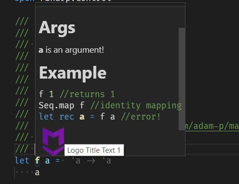
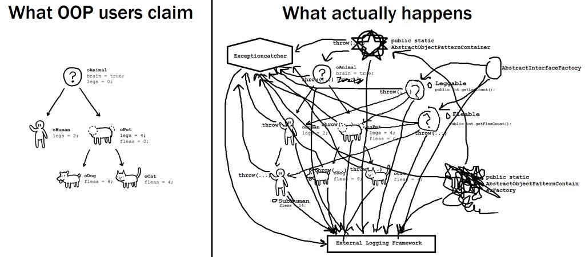

# F#

> A language that doesn't affect the way you think about programming is not worth knowing.
Alan J. Perlis

---

# Träume über C# Zukunft

Imaginäre PL, Zukunft der C#
Mehrere Schritte wo man was abkürzen kann

---

# Warum warten?

__DU__ hast es jetzt in deinen VS!

Einfach umbenennen:
- `*.cs`     -> `*.fs`
- `*.csproj` -> `*.fsproj`
- `*.csx`    -> `*.fsx`

Noch nichts von `*.csx` gehört? Kein Wunder

---

- ~Bleeding Edge~ been around for 18 Yeears already
- ~Completely Foreign~ Same as C#
  -  Same SDK
  -  Same Frameworks
  -  Same IDE (VS, VSCode, Rider)
  -  Same Tools (NuGet, dotnet build, test, etc) and more
  -  Same libraries
  -  Same Docker image

# What's not same C# != F#

```sql
select differences from cs_to_fs
order by Importance
```

1. Short Syntax
2. Type Inference
3. Strong Type system
4. Other Defaults
5. Other Philosophy https://docs.google.com/presentation/d/1REaSgy_JdytKg1xX-nzHqGys-_9KnpBvEagFNHL87Vc/edit#slide=id.g6ef9ada57b_6_279

---

# Kurze Syntax

| Implementation | C#     | F#    |
| -------------- | -------|-------|
| Braces         |  56929 |   643 |
| Blanks         |  29080 |  3630 |
| Null Checks    |   3011 |    15 |
| Comments       |  53270 |   487 |
| Useful Code    | 163276 | 16667 |
| App Code       | 305566 | 21442 |
| Test Code      |  42486 |  9359 |
| Total Code     | 348430 | 30801 |

---

# Kurze Syntax ist nicht Grund genug?

Technology confidence Chart

Start right now with FP by zero.

---

# Wrong defaults - nullable, mutable,

---

# Nullable

- Do you need any arguments against NullPointerExceptions?
- You can not really defend your code
- Next C# tries to fix this
  - in one of many ugly ways (backwards compatibility)
  - Guess what? Not nullable reference types!

---

# Mutability is the root of all evil generation 0 GCs

- GC - generations
  - Generation 0
    - mostly new, intermediate objects
    - GC is optimized to dispose them first
  - Generation 1
    - longer alive
    - much more complex to free the memory

- Immutable
  - many short lived new objects
  - (Generation 0) only can point to older objects
- Mutable
  - other way around: older -> newer, e.g. mutable collection
  - fewer, longer lived objects - not a Generation 0

---

# Mutable

- good luck to find who changes your object
- even worse in multi-threaded environment
- YES - it is because of performance
- But NO - immutable doesn't mean slow, because...

---

OOP | FP  |
--- | --- |
- encapsulation
- polimorphysm
- inheritance |
- isolation
- composition
- purity |

---

# OOP world
- abstraction (logger, orm)
    - orm - good luck to implement both mongodb, postgres
    - pub/sub - rabbit vs kafka - throw away your subscription methods
    - logger - change from serilog to others - throw away every logging line
- extensibility
    - where's my implementation? look in base or derived clases
    - where's my state? same
    - can you keep it in your head? depend on "go to usage"
    - interface just for mocks
    - how many interfaces having exacly one impl?
- encapsulation
    - how many methods/responsibilites per class?
    - ideally just one, but then why we have the class at all again?

Was hat C# und F# gleich

---

# FP world

- abstractions ???
    - functions!
- extensibility?
    - composition of functions!
- isolation
    - input -> output
    - you always know all about your function
    - pure function is already isolated
    - `serialze: Person -> BsonDocument`
    - `deserial: BsonObject -> Person`

---

# Was hat C# und F# gleich

---

### F#-only features

- Computation expressions:
  * ***async***, query, mongo, seq, cloud, arm, log, ...
- Type providers - for any structured data
  * sql, csv, xml, json, wmi, odata, wsdl, hadoop/hive, typescript, excel, swagger, registry, chess...
- Measure-types - currency, physical units
- Discriminated unions - compare to inheritance hell
- Active patterns - compare to scala unapply

---

## Lambda

```csharp
    // vorher
    var byAge = personen.Sort(new ComparerPersonByAge());
    public class ComparerPersonByAge : IComparer<Person> {
        ...
    }
    // nachher
    var byName = personen.OrderBy(x => x.LastName);
    var byAge  = personen.OrderBy(x => x.Age);
```

```fsharp
    let byName = personen |> Seq.sortBy(fun p -> p.LastName)
    let byAge  = personen |> Seq.sortBy(fun p -> p.Age)
```

---

# Was C# zwar hat, aber in F# ist es besser

## Type Inference

There seems to be a popular misperception that type annotation are always mandatory
in all typed languages. So the idea here is to show tha tyou can write entire
programs without them, and then when we do insert some type annotation
we explain why we chose to

```csharp
    Dictionary<string,int> dict1 = new Dictionary<string,int>();
    var dict2 = new Dictionary<string,int>();
    dict2.Add("",1);
```

```fsharp
    let dict1 = Dictionary<_,_>()
    let dict2 = Dictionary() // dict2 : Dictionary<string,int>
    dict.Add("",1)

    let addTwo i = // addTwo : int -> int
        i + 2
    let addTwoAndPrint i = // addTwoAndPrint : int -> unit
        printfn "%i" (addTwo i)
```

---

# Was C# zwar hat, aber in F# ist es besser

---

## REPL

- CSI - C# Interactive
- FSI - F# Interactive

```
$ fsharpi

Microsoft (R) F# Interactive version 4.1
Copyright (c) Microsoft Corporation. All Rights Reserved.

For help type #help;;

> let speed = 30
- let distance = 60
- let time = distance / speed;;
val speed : int = 30
val distance : int = 60
val time : int = 2
>
```

---

## Scripting

- C# - `*.csx`
  - Visual Studio Code
- F# - `*.fsx`
  - von Anfang an für Scripts vorbereitet
  - Visual Studio, Visual Studio Code, JetBrains Rider, vim

---

# C# Scripting

Aber möglich mit `dotnet-script`:

```sh
dotnet tool install -g dotnet-script
```

```csharp
#!/usr/bin/env dotnet-script
#r "nuget: System.Text.Json, 4.7.1"

using System.Text.Json;

var numbers = JsonSerializer.Deserialize<int[]>("[1,2,3]");
```

---

Noch nichts von `*.csx` gehört? Kein Wunder, ohne IDE nicht sehr nützlich

    C:\Users\scott\Desktop\scriptie>dotnet script
    > 2+2
    4
    > var x = "scott hanselman";
    > x.ToUpper()
    "SCOTT HANSELMAN"

---

# F# Scripting

- F# is scripting ready
- IDE-Unterstützung bei `*.fsx` wie bei `*.fs`


# Was C# zwar hat, aber in F# ist es besser

## Async programming

```fsharp
    let getRecommendations sku =
        async {
            let! ware = store.GetAllAsync sku
            let! similar = ml.CalculateSimilar ware.Features
            let recommendations = similar |> List.take 10
            return recommendations // not your usual 'return' keyword
        }
```

---

# Was klaut C# (von F#)

 Feature                | F#   | C#
------------------------|------|-----------
Lambda                  | ✓    | 3.0 (2007)
Type inference          | +-   | 3.0 (2007) - var, LINQ only records
REPL                    | +-   | 6.0 (2007)
Scripting               | +-   | 2017 `csharp-scripting` - cake, etc.
Async programming       | 2007 | 6.0 (2012)
Local functions         | +-   | 7.0 (2017)
Tuples                  | +-   | 7.0 (2017)
Pattern matching        | +-   | 7.0 (2017)

---

# Was hat F# mehr als C#

 Feature                | F# | C#
------------------------|----|---------
Records                 | ✓  | 9.0?
`using` expression      | ✓  | 8.0 (2019)
Not nullable by default | ✓  | 8.0 (2019)
Markdown in code docu   | ✓  | nicht geplant
Immutability by default | ✓  | nicht geplant
Typesafe printf         | ✓  | nicht geplant
Algebraic types         | ✓  | nicht geplant
Type providers          | ✓  | nicht geplant
Computation expression  | ✓  | nicht geplant

---

# Async/Await

Glorreiche Erfindung von C# ?

 Year| Language   |
2007 | F#         | workflows builders, async
2009 | Axum       | Imperative async/await syntax
2010 | M#         | Imperative "C#-like" syntax, applied to 10M LOC codebase, perf optimizations
2012 | C#         | `async/await` as you know it in all the languages.
2014 | Dart       |
2015 | Python     |
2015 | TypeScript |
2017 | JavaScript |
2019 | rust       |
2019 | C++        | co_await/co_yield/co_return

---

# Easy custom operator definition

    let (=>) a b = a,b

    let myDict = [
        "Hi" => 1,
        "Hello" => 2,
        "Hola" => 3,
        "Привет" => 1000
    ]

---

# Pipe operator

    let (|>) x f = f x

    bus
    |> detectDevice
    |> paintBody Color.Red
    |> removeAll (fun device -> not device.IsActive)
    |> publishData

    publishData(removeAll (fun device -> not device.IsActive, paintBody(Color.Red, detectDevice(bus))))

---

# Package manager

| NuGet              | Paket |
| Build-In           | Native NuGet Support |
| No Transitive Deps |  Handles Transitive deps |
| No package conflict resolution  | Full control over conflicts |
| no reproducible builds due no lock file (planned for per-project) | paket.lock for maintainability |
| Limited command line commands | Rich command line commands |
| No other sources to restore than NuGet | also Git, GitHub, HTTP |

---

# Markdown in code docu

```fsharp
/// # Args
/// **a** is an argument!
///
/// # Example
/// ```fsharp
/// f 1 //returns 1
/// Seq.map f //identity mapping
/// let rec a = f a //error!
/// ```
/// 
let f a =
    a
```



# Syntax, Sprachfeatures... YOLO!

Neuen Syntax lernen
Neue Sprachfeatures lernen

## Ich habe keine zwei Leben. Was gibt es noch?

---

# Vorurteile

Was denkt man (zu) oft über FP

- FP ist für spezielle Nichen wie
    - Finanzen und Buchhaltung
    - Mathematische Berechnungen
    - AI
- FP ist akademisch, nichts für real world
  oder wie kann man damit programmieren:
    - Web Backend
    - Web Frontend
    - Mobile
    - Desktop apps
    - Tests
    - CI/Build scripte

---

# Vorurteil 1. F# ist nichts für Backend

<table><tr><td>

## ASP.NET Core

```fsharp
/// **Movies** Controller, `/movies` route
[<Route("movies")>]
type MoviesController() =
    inherit Controller()

    /// load movie list
    [<HttpGet>]
    member __.Get() =
        base.Ok MoviesMgr.getAll

    /// post a new movie
    [<HttpPost>]
    member __.Post(movie : Movie) =
        MoviesMgr.create movie
        base.Created (newUrl, newMovie)

    /// load popular movies
    [<HttpGen("popular")>]
    member __.PopularMovies() =
        base.Ok MoviesMgr.popularMovies
```

</td></tr><tr><td>

## Giraffe

```fsharp
let movies = // movies : HttpHandler
    choose [
      route "/movies" >=> choose [
          Log
          GET >=> MoviesMgr.getAll
          basicAuth
          POST >=> MoviesMgr.create
        ]
      route "/movies/popular"
        >=> GET >=> MoviesMgr.popularMovies
      NOT_FOUND
    ]
```

</td></tr></table>

---

# Vorurteil 2. F# ist nichts für Browsers.

<table><tr><td>

## SERVER

```fsharp
let movie (id : int) : HttpHandler =
    fun next ctx ->
        // Load, filter, serialize
    json movie
````

</td></tr>
<tr><td>

## BROWSER

```fsharp
let getMovie (id : int) : Promise<ClientMovie> =
    // Send request, handle response, deserialize
    return movie
```

```fsharp
let viewMovie movie =
    Html.section [
        Html.h1 movie.Name
        Html.txt movie
    ]
```

</td></tr>
<tr><td>

## SHARED TYPE

```fsharp
type ClientMovie = {
    Id : int
    Name : string
    Year : int
    Rating : float
}
```

</td></tr></table>

---

# Ernsthaft. Was gibt es noch?

Was bringt mir das Lernaufwand

- Einfacher zu lernen als man denkt.
- Schwieriger schlechten code zu schreiben.
- Besseren Verständnis von OOP
- Leben danach viel einfacher.
- [Besser bezahlt!](top-payed)
- ~~Haare geschmeidiger~~

---

# Vorteile

- Ein mal schreiben und vergessen
- Stärkeres Typsystem
- Bessere tools
- Testbarkeit
- Leichtere Refactoring
- Andere, oft bessere Bibliotheken
- Community

---

# Praktische Vorteile

- Weniger Code zu lesen,
    - Zwingend formatiert
    - Zwingend strukturiert
    - Zwingend typisiert
- Geschrieben -> vergessen
- Zero NullReferenceExceptions
- Zero Mocks

# SOLID Principles


|  OOP                          | FP
|-------------------------------|---
| _S_ingle Responsibility (SRP) | Function
| _O_pen/Closed principle (OCP) | Function
| _L_iskoff Substitution (LSP)  | Ebenso
| _I_nterface Segregation (ISP) | Ja, functions
| _D_ependency Inversion (DIP)  | Oh my, again!

---

# SOLId Principles functional way

- Stateless - no mutable state
- Objectless - no communicating object, just pure data structures
- Loosely coupled - no inheritance, just function signatures
- Idempotent - multiple calls with same parameters yield same result
- Deterministic - easier to achive with pure functions

# OOP Design Patterns

|  OOP      | FP
|-----------|---------------------------
| Builder   | Build()
| Strategy  | `List.Sort(x=>x.Name)`|
| Decorator | HttpMessageHandler(LoggingMessageHandler) - aus Chassy
| Visitor   | Visit()

https://fsharpforfunandprofit.com/fppatterns/

https://medium.com/@cscalfani/goodbye-object-oriented-programming-a59cda4c0e53

---

# OOP Claims

- Inheritance
- Encapsulation
- Polymorphism

Banana-Monkey-Jungle problem

---

# OOP Reality


# F# features
- Computation expression (CE) `seq { for i in 1..10 -> i }`, async, query, CIL, expecto https://panesofglass.github.io/computation-expressions/#/10/3
- Algebraic Data Types (ADT) option, result, ?
- Pattern matching
- Better defaults

# SRTP - Statically Resolved Type Parameters

```fs
open System

type Circle = Circle of radius:double
type Rectangle = Rectangle of width:double * length:double

type CircleShape() =
    member this.Area(Circle(radius)) = Math.PI * Math.Pow(radius, 2.)
let circleShape = CircleShape()

type RectangleShape() =
    member this.Area(Rectangle(width, length)) = width * length
let rectangleShape = RectangleShape()

let inline areaOf shapeImpl shape =
    ( ^T : (member Area : 'A -> double) (shapeImpl, shape))
```

---

# SRTP

```fs
let inline tryParse< ^a when ^a : (static member TryParse : string * ^a byref -> bool) > s =
    let r = ref Unchecked.defaultof< ^a >

type MultipleTypes=
    { MyInt : int
      MyDateTime : DateTime
      MyDouble : double
    }
let results =
    { MyInt = tryParse "152"
      MyDateTime = tryParse "01.04.2019"
      MyDouble = tryParse "42.42"
    }
```

---

# Tuples

```csharp
var tuple = Tuple.Create(42, "The answer");
var number = tuple.Item1;
var answer = tuple.Item2;
```

```fsharp
let tuple = 42, "I swear"
let number, answer = tuple
```

C# 8.0

```csharp
var tuple = (42, "The answer");
var (number, answer) = tuple;
```

---

# Records

```fsharp
type Person =
    { FirstName : string
      LastName  : string
      Age       : int
    }
let Bonjovi =
    { FirstName = "John"
      LastName  = "Bon Jovi"
      Age       = 57
    }
```

---

# Records (anonym)

```fsharp
    let a   = {| A = 42 |}
    let afu = {| a with F = 'f'; U = "wow" |}
    // afu =  {| A = 42; F = 'f'; U = "wow"|}
    let af  = {| afu without U |}
    // af =   {| A = 42; F = 'f'|}
    let sänger = {| BonJovi with OnTour = false|}
    let x =  {| F = 1 |}
    let y =  {| U = 2 |}
    let xy = {| include x; include y |}
    // xy =  {| F = 1; U = 2|}
```

---

# Object expressions

## Look mum - no Mock frameworks!

One of few things where even Java is ahead.

```fsharp
let time = { new ITime with
    member mock.GetHour() = 15
}
```

```csharp
public class FakeTime : ITime {
    ...
}
var time1 = new FakeTime();

var time2 = new Mock<ITime>().Setup(x => x.GetHour()).Returns(15);
```

---

# ADT - Algebraische Datentypen

## Product

ID x UserName x FirstName x LastName x EMail

## Sum Type

Cache + Check + CreditCard + PayPal

---

# ADT - Algebraische Datentypen

| Language  | Feature              |
| F#        | Discriminated Unions |
| Elm       | Variants             |
| Rust      | Enumerations         |
| Swift     | Enumerations         |
| Kotlin    | Sealed Classes       |
| Haskell   | Algebraic Data Types |
| C/C#/Java | Nope ¯\_(ツ)_/¯       |

---

# ADT - Algebraische Datentypen

- Option
- Either
- Result
- Smart enums
- ...

---

# C#-Way

- Find a User by ID in BD
- Exception vs null? :thinking:
- Namenskonvention
    - `public User GetUser(id)` - throws if not found. Needs try-catch!
    - `public User FindUser(id)` - return `null` if not found. Handle it youself later!

---

# F#-Way

```fsharp
/// returns User, no nulls, no errors. Exceptions are generally possible though
let getUser(id : UserId) : User = ...

/// returns None if not found, Some user if found
let findUser(id: UserId) : User option = ...

/// returns Ok user if found, Failure domainError if not
let tryGetUser(id : UserId) : Result<User,DomainError> = ...
```

---

# F#-Way

What matters is a type signature, no silly naming conventions

```fsharp
let findUser(userId) : Async<Result<Option<User>,DomainError>>

let parse(json): Result<Config,ParseError>
```

---

# Event Sourcing

- No DB Scheme / No Migration / No ORM
- No destructive actions - no information loss
- Different interpretation of the past possible

---

# Quotes

>"Complexity is anything that makes software hard to understand or to modify." — John Outerhout

---

# Vorteile

- Bringt Sicherheit über das was der Code eigentlich macht. Weniger Sorgen, dass:
    - jemand ändert liste der Devices, wärend die bearbeitet wird
    - ticketSend ist von anderen Objekten abhängig ist
    - dass die Reihenfolge der Aufrufe falsch sein kann
    - dass Projektstruktur verschwimmt - compiler sorgt für Ornung
    - keiner übergibt `mm` statt `MB`
    - dass der neue alles kaputt refactoren kann
- Leichter zu testen
    - Ausgabe oder Effekte hängen nur von der Eingabe ab - keine Mocks
- Leichter aufzuteilen und zusammenführen
    - Funktionen sind leichter aufzuteilen oder zusammenführen
- Leichter komlexe Businessdaten Domain klarer zu definieren

---

# Nachteile

- keine `NullReferenceException`, weil keine `null`
- kein `return` - was ist die Rückgabe
- keine geschweifte Klammern - ich sehe die Grenzen nicht mehr
- keine Unit-Tests möglich, weil `kompiliert` == `funktioniert`
- designed für Mathe und AI, daher zu akademisch

---

# Wirkliche Nachteile

- C# hat excellentes Tooling, F# weniger
    - Weniger Refactoring-Support (eigentlich weniger wichtig)
    - Wenig Debugger-Support (auch nicht so gebräuchlich)
    - Weniger statische Analysers, Linters
- C# hat riesiges Community, F# kleineres
    - somit weniger F# Jobs ( dafür teurere )
- Kein F# und C# in einem Project möglich (aber durchaus in einem Solution)
- Unerwartete NullReferenceExceptions von C# bibliotheken möglich
- C# (bzw. ganz OOP) fängt an zu stinken: "in F# könnte ich einfach..."

---

# Links
- [10 reasons not to use FPL][10-reasons]
- [Get started F# as C# dev][get-started-cs]
- [Top paying Technologies][top-payed]
- http://armlinux.ro/FablePresentation2018/#/
- https://www.slideshare.net/AntyaDev/adopting-f-at-sbtech


# Images
- [Всё еще пишешь на C#?]
https://twitter.com/gsomix/status/940159910070947841
- Elmish vs React:
  - https://twitter.com/mikebild/status/888042176738971649/photo/1
  - https://raw.githubusercontent.com/uanders/react-redux-cheatsheet/master/1440/react-redux-workflow-graphical-cheat-sheet_v110.png

- [Snowflake](https://www.urbandictionary.com/define.php?term=Snowflake)


[10-reasons]: https://fsharpforfunandprofit.com/posts/ten-reasons-not-to-use-a-functional-programming-language/
[why-learn]: https://dusted.codes/why-you-should-learn-fsharp#solid-made-easy-in-fsharp
[unlearn-oop]: https://dpc.pw/the-faster-you-unlearn-oop-the-better-for-you-and-your-software
[get-started-cs]: https://blogs.msdn.microsoft.com/dotnet/2017/07/24/get-started-with-f-as-a-c-developer/
[top-payed]: https://insights.stackoverflow.com/survey/2018#top-paying-technologies
[top-payed2]: https://insights.stackoverflow.com/survey/2018/#technology-what-languages-are-associated-with-the-highest-salaries-worldwide
[cheat-sheet]: (http://dungpa.github.io/fsharp-cheatsheet/)
[workshop]: (http://www.fsharpworkshop.com)
[goodbye-oop]: (https://medium.com/@cscalfani/goodbye-object-oriented-programming-a59cda4c0e53)
